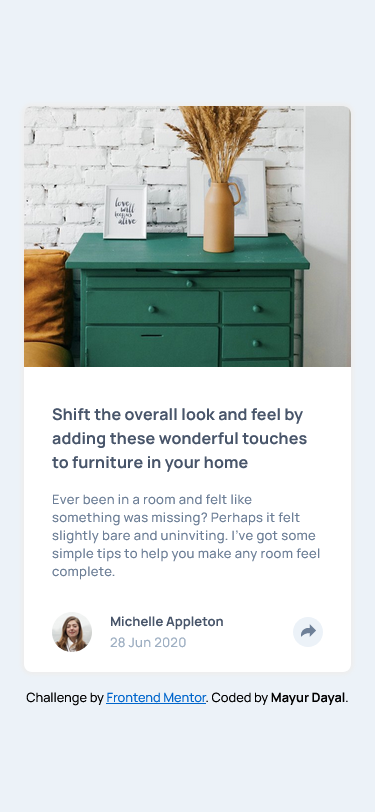
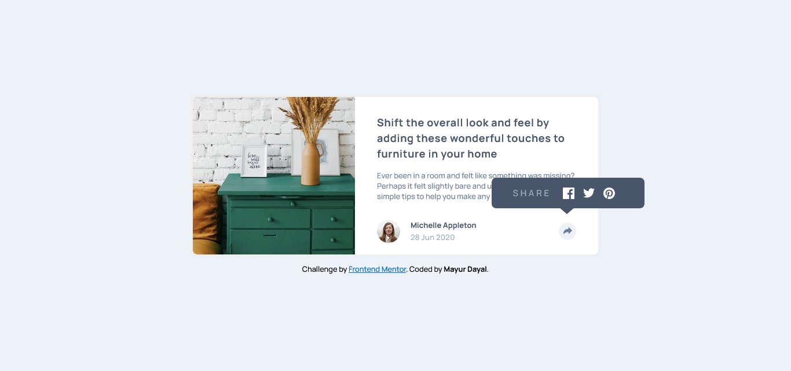
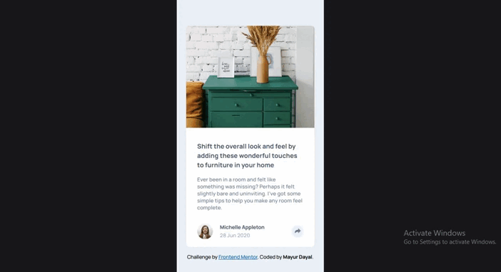

# Frontend Mentor - Article preview component

This is a solution to the [Article preview component challenge on Frontend Mentor](https://www.frontendmentor.io/challenges/article-preview-component-dYBN_pYFT). Frontend Mentor challenges help you improve your coding skills by building realistic projects. 

## The challenge

Your challenge is to build out this article preview component and get it looking as close to the design as possible.

You can use any tools you like to help you complete the challenge. So if you've got something you'd like to practice, feel free to give it a go.

The only JavaScript you'll need for this challenge is to initiate the share options when someone clicks the share icon.

Users should be able to:

- View the optimal layout for the component depending on their device's screen size
- See the social media share links when they click the share icon

**To do this challenge, you need a basic understanding of HTML, CSS and a tiny bit of JavaScript.**

## Screenshot

### Mobile Screenshot

### Desktop Screenshot

### Active State Screenshot

## Links

- Solution URL: [https://github.com/mayurDayal2000/article-preview-component-main](https://github.com/mayurDayal2000/article-preview-component-main)
- Live Site URL: [https://mayurDayal2000.github.io/article-preview-component-main/](https://mayurDayal2000.github.io/article-preview-component-main/)

# Built with

- Semantic HTML5 markup
- CSS custom properties
- Flexbox
- CSS Grid
- CSS Transition
- Mobile-first workflow
- JavaScript DOM manipulation
- JavaScript Function Expression

## Author

- Frontend Mentor - [@mayurDayal2000](https://www.frontendmentor.io/profile/mayurDayal2000)
- Twitter - [@mayur_dayal_5k](https://twitter.com/mayur_dayal_5k)